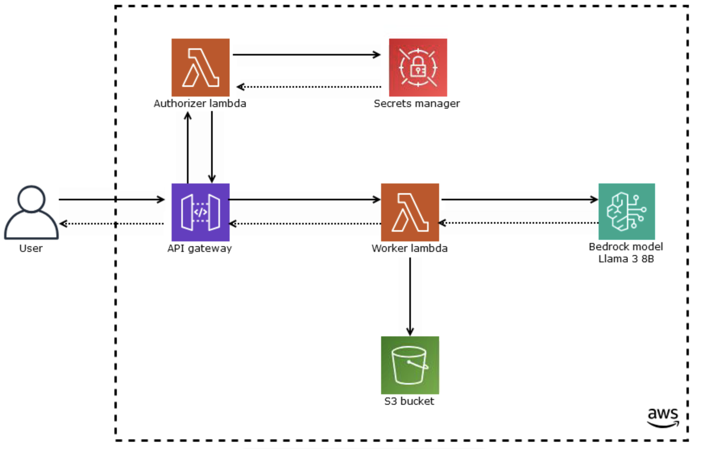

# LynxLab

LynxLab is a cloud lab setup utility that streamlines the deployment of an AI-driven pipeline, illustrated through a sentiment analysis use case. Beyond AI experimentation, it enables security practitioners to simulate attacks and evaluate defense strategies for serverless components in the cloud.

### :rocket: Design



### :pencil: Prerequisites
1. python3, pip3
2. Postman for API invocation
3. A free tier AWS account - https://aws.amazon.com/free/
4. AWS CLI to access the AWS account - https://aws.amazon.com/cli/
5. Request model access for **Llama 3 8B Instruct** as per the instructions [here](README-model-access.md).

### :computer: Setup
Step 1: Start by pulling all the dependencies required for the project

`pip install -r requirements.txt`

Step 2: Configure settings for the AWS CLI by creating a file `~/.aws/config` with contents as

```
[default]
region = <your-region>
aws_access_key_id = <your-secret-key-id>
aws_secret_access_key = <your-secret-access-key>
```

Step 3: Set env variable `APIGW_TOKEN`  by running the command

`export APIGW_TOKEN='<your-secret-access-key>'`

Step 4: To create the LynxLab stack, run the command

`python3 driver.py create`


Step 5: To get the invocation URL for the API gateway, run the command

`python3 driver.py getUrl`


Step 6: Use the URL returned above to pass in the input for sentiment analysis via curl cli or use Postman for API invocation.

```
curl -s -X GET -H "Authorization: Bearer $APIGW_TOKEN" "<replace by returned URL>/dev/invoke?inputText=Gill%20%2C%20Rahul%20and%20Jaiswal%20got%20out%20for%200%20runs%20in%20cricket%20match%20against%20Australia&inputTask=Perform%20the%20sentiment%20analysis"
```


Step 7: Finally to destroy the Lynxlab stack, run the command

`python3 driver.py destroy`
